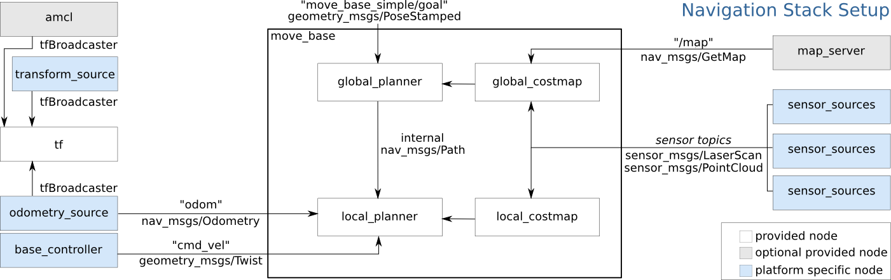
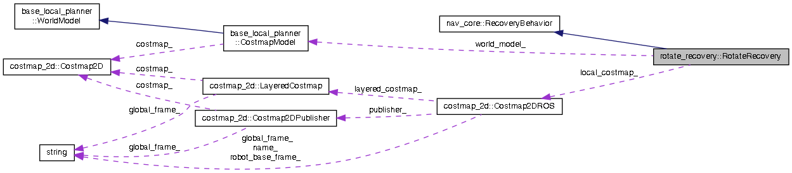

# ROS navigation stack

# 1.navigation梳理

## 1.1 navigation 概述



**核心：**

- move_base包

**输入：**

- `/tf`:`map_frame`、`odom_frame`、`base_frame`以及机器人各关节之间的完成的一棵tf树。
- `/odom`:里程计信息
- `/scan`或`/pointcloud`:传感器的输入信息，最常用的是激光雷达(sensor_msgs/LaserScan类型)，也有用点云数据(sensor_msgs/PointCloud)的。
- `/map`：地图，可以由SLAM程序来提供，也可以由`map_server`来指定已知地图。

以上四个Topic是必须持续提供给导航系统的，下面一个是可随时发布的topic：

- `move_base_simple/goal`:目标点位置。

**输出：**

- `/cmd_vel`:`geometry_msgs/Twist`类型，为每一时刻规划的速度信息。

包含的package:

|          包名          |                             功能                             |
| :--------------------: | :----------------------------------------------------------: |
|          amcl          |                             定位                             |
|   fake_localization    |                             定位                             |
|       map_server       |                           提供地图                           |
|       move_base        |                         路径规划节点                         |
|        nav_core        | 路径规划的接口类，包括base_local_planner、base_global_planner和recovery_behavior三个接口 |
|   base_local_planner   |        实现了Trajectory Rollout和DWA两种局部规划算法         |
|   dwa_local_planner    |                  重新实现了DWA局部规划算法                   |
|     parrot_planner     |                  实现了较简单的全局规划算法                  |
|         navfn          |                实现了Dijkstra和A*全局规划算法                |
|     global_planner     |              重新实现了Dijkstra和A*全局规划算法              |
| clear_costmap_recovery |                 实现了清除代价地图的恢复行为                 |
|    rotate_recovery     |                     实现了旋转的恢复行为                     |
|  move_slow_and_clear   |                   实现了缓慢移动的恢复行为                   |
|       costmap_2d       |                         二维代价地图                         |
|       voxel_grid       |                             三维                             |
|     robot_pose_ekf     |                    机器人位姿的卡尔曼滤波                    |

## 1.2 nav_core

nav_core包提供了机器人导航的通用接口，现在主要提供了**BaseGlobalPlanner**,**BaseLocalPlanner**

和**RecoveryBehavior**接口。所有希望用做move_base插件的规划器和修复器都必须继承自这些接口。

接口的作用一般是为了统一不同规划器的输出、输入，使得后续程序可以适应不同规划器。


### 1.2.1 BaseGlobalPlanner

使用此接口的全局规划器有：

- [global_planner](http://wiki.ros.org/global_planner) - 重新实现了navfn. (pluginlib name: "global_planner/GlobalPlanner")
- [navfn](http://wiki.ros.org/navfn) - 基于栅格的全局规划器 (pluginlib name: "navfn/NavfnROS")
- [carrot_planner](http://wiki.ros.org/carrot_planner) - 简单的全局规划器，让机器人尽可能的靠近目标点，即使目标点有障碍物 (pluginlib name: "carrot_planner/CarrotPlanner")

#### 1.2.1.1 类继承关系图


#### 1.2.1.2 GlobalPlanner的协作图


#### 1.2.1.3 CarrotPlanner的协作图


#### 1.2.1.4 Navfn的协作图


### 1.2.2 BaseLocalPlanner

使用该接口的局部规划器有：

- [base_local_planner](http://wiki.ros.org/base_local_planner) - 实现了DWA和Trajectory Rollout的local control
- [dwa_local_planner](http://wiki.ros.org/dwa_local_planner) - 重新实现了DWA，更干净易懂
- [eband_local_planner](http://wiki.ros.org/eband_local_planner) -EB算法
- [teb_local_planner](http://wiki.ros.org/teb_local_planner) - TEB算法，在线轨迹优化
- [mpc_local_planner](http://wiki.ros.org/mpc_local_planner) -MPC算法

这些局部规划器需要在各自的源文件中注册成为插件：

```c++
//register this planner as a BaseLocalPlanner plugin
PLUGINLIB_EXPORT_CLASS(dwa_local_planner::DWAPlannerROS, nav_core::BaseLocalPlanner)
    
//register this planner as a BaseLocalPlanner plugin 注册局部规划器为一个插件
PLUGINLIB_EXPORT_CLASS(base_local_planner::TrajectoryPlannerROS, nav_core::BaseLocalPlanner)
```

#### 1.2.2.1 类继承关系图

下图是navigation工程中的类继承关系，eb,teb,mpc并不在该工程中.


#### 1.2.2.2 TrajectoryPlannerROS的协作图


#### 1.2.2.3 DWAPlannerRos的协作图


### 1.2.3 RecoveryBehavior

使用该接口的修复机制：

- [clear_costmap_recovery](http://wiki.ros.org/clear_costmap_recovery) 
- [rotate_recovery](http://wiki.ros.org/rotate_recovery) 

这些恢复行为也要在各自的源文件中注册成为插件：

```c++
PLUGINLIB_EXPORT_CLASS(clear_costmap_recovery::ClearCostmapRecovery, nav_core::RecoveryBehavior)

// register this planner as a RecoveryBehavior plugin
PLUGINLIB_EXPORT_CLASS(move_slow_and_clear::MoveSlowAndClear, nav_core::RecoveryBehavior)

// register this planner as a RecoveryBehavior plugin
PLUGINLIB_EXPORT_CLASS(rotate_recovery::RotateRecovery, nav_core::RecoveryBehavior)
```


#### 1.2.3.1 类继承关系图：


### 

#### 1.2.3.2 ClearCostmapRecovery协作图


#### 1.2.3.4 RotateRecovery协作图



#### 1.2.3.5 MoveSlowAndClear协作图


## 1.3 move_base

### 1.3.1 概述

move_base类图：

包含两个枚举，一个class


**输入：**

- `/tf`:`map_frame`、`odom_frame`、`base_frame`以及机器人各关节之间的完成的一棵tf树。
- `/odom`:里程计信息
- `/scan`或`/pointcloud`:传感器的输入信息，最常用的是激光雷达(sensor_msgs/LaserScan类型)，也有用点云数据(sensor_msgs/PointCloud)的。
- `/map`：地图，可以由SLAM程序来提供，也可以由`map_server`来指定已知地图。

以上四个Topic是必须持续提供给导航系统的，下面一个是可随时发布的topic：

- `move_base_simple/goal`:目标点位置。

**输出：**

- `/cmd_vel`:`geometry_msgs/Twist`类型，为每一时刻规划的速度信息。


move_base需要选择插件，包括三种插件：`base_local_planner`、`base_global_planner`和`recovery_behavior`，如果不指定，系统会指定默认值。

**base_local_planner插件：**

- base_local_planner: 实现了Trajectory Rollout和DWA算法
- dwa_local_planner: 实现了DWA算法，base_local_planner的改进版

**base_global_planner插件：**

- parrot_planner: 简单的全局规划算法
- navfn: Dijkstra和A*全局规划算法
- global_planner: 重新实现了Dijkstra和A*全局规划算法，navfn的改进版

**recovery_behavior插件：**

- clear_costmap_recovery: 清除代价地图的恢复行为
- rotate_recovery: 旋转的恢复行为
- move_slow_and_clear: 缓慢移动的恢复行为

### 1.3.2 构造函数

```c++
//订阅rviz下发的目标点
ros::NodeHandle simple_nh("move_base_simple");
goal_sub_ = simple_nh.subscribe<geometry_msgs::PoseStamped>("goal", 1, boost::bind(&MoveBase::goalCB, this, _1));

//下发命令(话题)给基座
vel_pub_ = nh.advertise<geometry_msgs::Twist>("cmd_vel", 1);
current_goal_pub_ = private_nh.advertise<geometry_msgs::PoseStamped>("current_goal", 0 );

//新建一个action server,回调函数是executeCb()
as_ = new MoveBaseActionServer(ros::NodeHandle(), "move_base", boost::bind(&MoveBase::executeCb, this, _1), false);

// 新建planner线程，入口函数为MoveBase::planThread
planner_thread_ = new boost::thread(boost::bind(&MoveBase::planThread, this));

// 初始化全局规划器
try {
    planner_ = bgp_loader_.createInstance(global_planner);
    planner_->initialize(bgp_loader_.getName(global_planner), planner_costmap_ros_);
} catch (const pluginlib::PluginlibException& ex) {
  exit(1);
}

// 创建局部规划器
try {
  tc_ = blp_loader_.createInstance(local_planner);
  ROS_INFO("Created local_planner %s", local_planner.c_str());
  tc_->initialize(blp_loader_.getName(local_planner), &tf_, controller_costmap_ros_);
} catch (const pluginlib::PluginlibException& ex) {
  exit(1);
}

//启动了两个服务
//advertise a service for getting a plan
make_plan_srv_ = private_nh.advertiseService("make_plan", &MoveBase::planService, this);
//advertise a service for clearing the costmaps
clear_costmaps_srv_ = private_nh.advertiseService("clear_costmaps", &MoveBase::clearCostmapsService, this);


//加载恢复行为
if(!loadRecoveryBehaviors(private_nh)){
  loadDefaultRecoveryBehaviors();
}

//动态参数服务器，可以动态修改参数
dsrv_ = new dynamic_reconfigure::Server<move_base::MoveBaseConfig>(ros::NodeHandle("~"));

dynamic_reconfigure::Server<move_base::MoveBaseConfig>::CallbackType cb = boost::bind(&MoveBase::reconfigureCB, this, _1, _2);

dsrv_->setCallback(cb);

```

### 1.3.3  planThread()

全局路径规划器线程

```c++
ROS_DEBUG_NAMED("move_base_plan_thread","Starting planner thread...");
ros::NodeHandle n;
boost::unique_lock<boost::recursive_mutex> lock(planner_mutex_);
while(n.ok()){
    // 确认是否要运行路径规划器(这里已经加锁)
    while(wait_for_wake || !runPlanner_){
    // 暂时关闭路径规划线程
        ROS_DEBUG_NAMED("move_base_plan_thread","Planner thread is suspending");
        // 注意planner_cond_.wait(lock)是在等待条件满足。
        // 如果条件不满足，则释放锁，将线程置为waiting状态，继续等待；
        // 如果条件满足，则重新获取锁，结束wait，继续向下执行
        planner_cond_.wait(lock);
        wait_for_wake = false;
    }
    ros::Time start_time = ros::Time::now();

    // 该开始规划了，复制路径规划器的目标点(注意这里在上次循环中加锁了)，然后在这次解锁。
    geometry_msgs::PoseStamped temp_goal = planner_goal_;
    lock.unlock();
    ROS_DEBUG_NAMED("move_base_plan_thread","Planning...");

    // 运行路径规划器，它的主要函数是makePlan
    planner_plan_->clear();
    //makePlan()中调用的是planner_->makePlan(start, goal, plan)。
    bool gotPlan = n.ok() && makePlan(temp_goal, *planner_plan_);
}
```

### 1.3.4 executeCb()

 // 控制(局部规划)的主要函数

```c++
void MoveBase::executeCb(const move_base_msgs::MoveBaseGoalConstPtr& move_base_goal){
	while(n.ok()) {
        //局部规划(导航到目标点)的主要调用executeCycle函数
        bool done = executeCycle(goal);
    }
}
```

```c++
bool MoveBase::executeCycle(geometry_msgs::PoseStamped& goal){
    // step xx move_base状态机，处理导航的控制逻辑
    switch(state_){
      // step x.x 如果是路径规划状态，计算路径
      case PLANNING:
      	// 加锁，唤醒路径规划器线程
      	break;
      // step x.x 如果是控制状态，尝试计算出有效的下发速度命令
      case CONTROLLING:
        if(tc_->computeVelocityCommands(cmd_vel)){}
        break;
	  // step x.x 用提供的恢复行为来清理空间，主要有三个恢复行为
      case CLEARING:
        recovery_behaviors_[recovery_index_]->runBehavior();
        break;
      default;
    }
}
```

